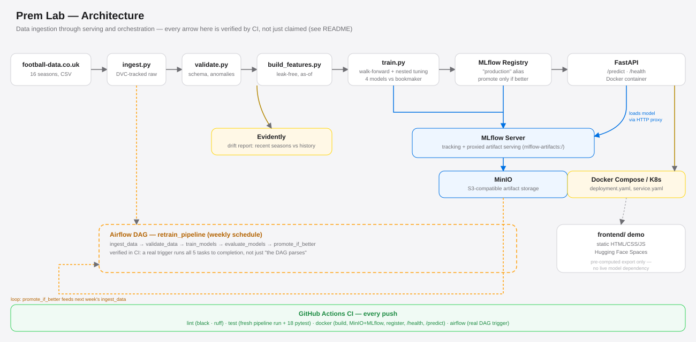

# Football Match Outcome Prediction — MLOps Pipeline

[](https://github.com/mateusz-gob1/football-outcome-mlops/actions/workflows/ci.yml)
[](LICENSE)

Predicts football match outcomes (Home Win / Draw / Away Win) for every
Premier League gameweek from three independently trained models (Logistic
Regression, Random Forest, XGBoost) - built on leak-free temporal
validation, calibrated probabilities, and a complete MLOps stack (experiment
tracking, model registry, serving, monitoring, CI/CD).

None of the three models are trained on bookmaker odds - they predict from
match statistics alone (form, head-to-head, rest days, table position), so
the same pipeline that validates on 16 seasons of history can serve a
fixture that hasn't been played yet without depending on a live odds feed.
The bookmaker's own pick is still shown alongside each prediction, purely as
a reference point - see `vault/Architecture-Decisions.md` ADR-022 for why
odds were deliberately left out as a model input, and the Methodology
section below for how the models compare to that market baseline.

**Status: Phase 1 (MVP) complete. Phase 2 complete. Phase 3 complete.**
Evidently drift monitoring, retraining pipeline with a promote-if-better
guard, Kubernetes manifests, the Airflow DAG, and MinIO artifact storage are
all verified end-to-end on every push (four green CI jobs: `lint`, `test`,
`docker`, `airflow`). The demo (live predictions for the next gameweek from
all three models) is live (see below).

## Architecture



Left to right: raw data → validation → leak-free feature engineering →
walk-forward training → MLflow Registry → FastAPI serving. The dashed box is
the Airflow DAG that wraps the same pipeline on a weekly schedule and loops
promote-if-better back into next week's ingest. The demo sits outside this
loop deliberately — it ships pre-computed exports (both historical results
and the next gameweek's predictions), not a live model server — see
ADR-020/024.

## Methodology & results

Premier League, 2010/11–2026/27 (17 seasons, 4143 out-of-fold walk-forward
test matches), from 31 features per model — form, head-to-head, rest days,
table position, and rolling-5-match shots/shots-on-target/corners/cards
(ADR-026) — evaluated without bookmaker odds as a model input (ADR-022).

| Model | Log-loss | Brier |
|---|---|---|
| Random Forest | 0.9936 | 0.5920 |
| Logistic Regression | 0.9936 | 0.5899 |
| Ensemble (average of all three) | 0.9979 | 0.5943 |
| XGBoost | 0.9999 | 0.5956 |

For context, a bookmaker consensus baseline (Bet365 + Bet&Win average
implied probability, ADR-012) scores 0.9597 log-loss on the same matches —
none of the models close that gap (95% bootstrap CI entirely above zero for
all of them), which is expected: the betting market prices in information
no historical-stats-only model can see (injury news, team news, sentiment),
and none of that goes into these models by design. A plain-average ensemble
of the three models was tried and scored *worse* than the best individual
model — see ADR-027 for why (equal-weight averaging drags the result toward
the weakest member). Full breakdown, including the pre-ADR-022 numbers from
when odds were still a model input, the pre-ADR-026 numbers from before the
match-stat features, and the ensembling/wider-search/recalibration check:
`vault/Evaluation-Log.md` Run 003/004/005.

## Setup

```bash
python -m venv .venv
.venv\Scripts\activate
pip install -r requirements.txt
pre-commit install  # optional: black + ruff on every commit
```

## Running the pipeline

```bash
python -m src.data.ingest        # download 16 seasons of Premier League CSVs
python -m src.data.validate      # schema/anomaly checks -> data/processed/matches_validated.csv
python -m src.models.train       # walk-forward CV + nested tuning, 4 models, MLflow logging
python -m src.models.evaluate    # Brier, calibration, bootstrap CI, feature importance/ablation
python -m src.models.registry    # registers the best model, promotes to the "production" alias
python -m src.monitoring.drift   # Evidently data drift report (recent seasons vs history)
```

Or run the whole cycle at once (this is what a scheduled retraining job
would call - see `src/pipeline/retrain_pipeline.py`):

```bash
python -m src.pipeline.retrain_pipeline
```

To predict the next, not-yet-played Premier League gameweek from all three
ML models (fixtures sourced from openfootball/england, since
football-data.co.uk only publishes played results - see ADR-023):

```bash
python -m src.pipeline.predict_upcoming
```

## Running the API

```bash
uvicorn src.serving.api:app --reload
```

- `GET /health` — service status and loaded model version
- `POST /predict` — requires `home_team`, `away_team`, `match_date`, and
  Bet365 odds (`b365h`, `b365d`, `b365a`); Bet&Win odds (`bwh`, `bwd`, `bwa`)
  are optional and averaged in when provided. The odds are **not** fed to the
  model (see ADR-022) — they're required in the request only because the
  same feature-building step also computes the display-only bookmaker
  reference used elsewhere in this project.

`docker-compose.yml` runs the API alongside MLflow (backed by MinIO for
artifact storage - `s3://mlflow-artifacts`, see ADR-019) for local
development, and is exercised end-to-end (build, register a real model
against the containerized MLflow, start, `/health`, `/predict`) by the
`docker` job in `.github/workflows/ci.yml` on every push - see ADR-011/014.
MinIO's web console is at `http://localhost:9001`
(`minioadmin` / `minioadmin123` - dev-only credentials).

## Orchestration (Airflow)

`dags/retrain_dag.py` wraps the same five steps as
`src/pipeline/retrain_pipeline.py` (ingest, validate, train, evaluate,
promote-if-better) as an Airflow DAG on a weekly schedule. Run locally via:

```bash
docker compose -f docker-compose.airflow.yml up
# UI at http://localhost:8080
```

Verified end-to-end by the `airflow` job in CI - not just that the DAG
parses, but that a real trigger runs all five tasks to completion. See
ADR-018 for the `airflow standalone` (single-container) choice and why.

## Continuous Integration

Every push to `main` runs four jobs on GitHub's own runners, not just locally
claimed to work: **[see live runs →](https://github.com/mateusz-gob1/football-outcome-mlops/actions)**

| Job | What it actually does |
|---|---|
| `lint` | `black --check` + `ruff check` across the whole codebase |
| `test` | Fresh `ingest → validate → train → registry` run, then all 60 `pytest` tests |
| `docker` | Builds both images, brings up MinIO + MLflow, registers a real model against them, starts the API, and curls `/health` + `/predict` |
| `airflow` | Builds the Airflow image, starts it, and **triggers the actual DAG** - all 5 tasks run to completion, not just "the file parses" |

Each of these is documented in `vault/Architecture-Decisions.md` with the
real bugs it caught on the way to green (ADR-014, ADR-018, ADR-019) - the
point isn't that it worked on the first try, it's that every claim here is
checked by a machine on every push, not asserted in prose.

## Demo

**Live: [matigob-football-outcome-predictor.static.hf.space](https://matigob-football-outcome-predictor.static.hf.space)** — branded **Prem Lab** on the page itself.

`frontend/` is a standalone static site (plain HTML/CSS/JS + Chart.js, no
server, no live model) with three tabs: **Next Matchday** (all three ML
models plus their ensemble average, picks for the upcoming gameweek, form
and head-to-head per fixture, league table, form guide, bookmaker pick shown
for reference), **Past Predictions** (browse historical out-of-fold results,
any of the four), and **Methodology**
(log-loss/Brier/calibration/feature importance, the betting-market
comparison discussed above). Every team name links to a real, bookmarkable
page (`#team/<name>`) themed in that club's own colors, with a real stadium
photo banner and identity facts (nickname, founding year, ground capacity).
It ships pre-computed exports rather than talking to a live model or API -
see ADR-020/024 for why. Deployed to Hugging Face Spaces (Static SDK) via
`git subtree push --prefix=frontend`. Club badges and stadium photos are
hotlinked from [TheSportsDB](https://www.thesportsdb.com)'s free API
(attribution in the page footer, per their terms of use) - never downloaded
or modified, with a colored-initials fallback for any team without a
resolved badge. Run locally:

```bash
cd frontend
python -m http.server 8000
# open http://localhost:8000
```

Regenerate the underlying JSON (after retraining, generating a new upcoming
gameweek's predictions, or if the data changes):

```bash
python -m src.pipeline.predict_upcoming   # next gameweek's predictions -> data/processed/reports/
python -m frontend.prepare_data           # -> frontend/data/*.json
```

Club badges and stadium photos rarely change, so they're resolved
separately and only need re-running when a new team appears
(promotion/relegation):

```bash
python -m frontend.prepare_badges         # -> frontend/data/team_badges.json
python -m frontend.prepare_stadiums       # -> frontend/data/team_stadiums.json
```

## Tests

```bash
pytest
```

60 tests: leak-free feature engineering (rolling stats, as-of table position,
cold-start, H2H window), walk-forward validation (nested tuning never touches
the outer test season), the odds/no-odds feature split (ADR-022 - the
bookmaker baseline must keep working on its own dedicated feature list), the
API (valid predictions, unknown team / zero-history / bad-input error
handling), the upcoming-fixture pipeline (openfootball parsing, team-name
normalization, bookmaker-odds attachment, and a regression test proving a
whole gameweek's fixtures are featurized independently - no cross-fixture
leakage into table position/form), the frontend's badge- and stadium-matching
logic (TheSportsDB team/venue lookup, nickname parsing, fanart/thumb
fallback), the recalibration check (ADR-027 - a synthetically miscalibrated
model must actually improve under isotonic recalibration, proving the
mechanism works), and the model registry's promote-if-better guard (a
deliberately worse candidate must not move the `production` alias).

## Project structure

See `vault/Architecture.md` for the full design and `vault/Architecture-Decisions.md`
for the reasoning behind key methodological choices (temporal validation, nested
tuning, class imbalance handling, cold-start, multi-bookmaker baseline, MLflow
registry, Docker, CI/CD).
